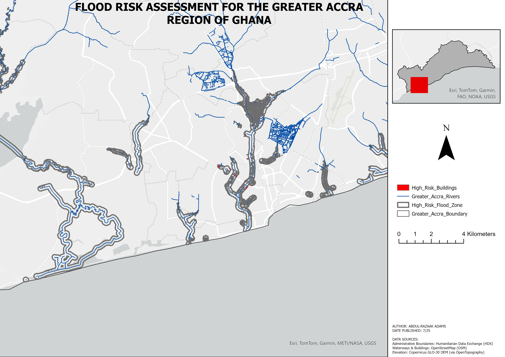

# 🌊 Flood Risk Assessment for the Greater Accra Region, Ghana

 

A comprehensive GIS analysis to identify buildings at high risk of flooding in Ghana's Greater Accra Region. This project integrates elevation data with hydrography to model vulnerable areas and assesses the direct impact on residential structures, culminating in a detailed cartographic map series.

---

## 🗺️ Final Product: A Detailed Map Series

The primary output of this project is a multi-page map series. This format was chosen over a single static map (like a heat map) because it allows for clear, detailed inspection of risk at the neighbourhood level while maintaining regional context through an inset map.

**➡️ [Download the Full Map Series PDF Here](Flood_Risk_Analysis.pdf)**

*(Note: You will need to upload your exported PDF and the sample PNG to your GitHub repository for this link to work.)*

---

## 🎯 Project Objective

The goal was to answer a critical question: **Which buildings in the Greater Accra Region are most vulnerable to flooding?**

This was achieved by defining a "High-Risk Flood Zone" based on two primary criteria:
1.  **Low Elevation:** Areas less than 15 meters above sea level.
2.  **Proximity to Rivers:** Areas within 150 meters of a river or major waterway.

Buildings located where both of these conditions are met were identified as the most at-risk.

## 🛠️ Methodology

The analysis was conducted in Esri ArcGIS Pro using the following workflow:

#### 📂 1. Data Preparation & Processing
-   Acquired administrative, hydrography, building, and elevation data from open-source portals.
-   Established a projected coordinate system (**WGS 1984 UTM Zone 30N**) for accurate spatial measurements.
-   Clipped all vector data (buildings, rivers) to the Greater Accra boundary to define the study area.
-   Used the **Extract by Mask** tool to clip the Digital Elevation Model (DEM) raster, ensuring all analysis was constrained to the region.

#### 🔬 2. Risk Factor Analysis
-   **Low Elevation Zone:** The clipped DEM was processed using the **Reclassify** tool to isolate all pixels with an elevation value below 15 meters.
-   **River Proximity Zone:** The **Buffer** tool was used to create a 150-meter zone around the river features.

#### ✨ 3. High-Risk Zone Delineation
-   The **Intersect** tool was used to combine the two risk factor layers. The resulting polygons represent the final "High-Risk Flood Zone" where both low elevation and river proximity are true.

#### 📄 4. Impact Assessment & Cartography
-   The **Select By Location** tool identified all building footprints that intersect with the High-Risk Flood Zone.
-   A **Map Series** was configured to automatically generate a detailed map for every part of the region containing at-risk areas.
-   An **Inset Map** with a dynamic extent indicator was added to provide constant regional context for each page of the series.

---

## 📊 Data Sources

| Data | Source | Link |
| :--- | :--- | :--- |
| Administrative Boundaries | Humanitarian Data Exchange (HDX) | [Link](https://data.humdata.org/dataset/cod-ab-gha) |
| Waterways & Buildings | OpenStreetMap (via Geofabrik) | [Link](http://download.geofabrik.de/africa/ghana.html) |
| Digital Elevation Model | Copernicus GLO-30 (via OpenTopography) | [Link](https://portal.opentopography.org/dataCatalog?group=dem&id=ot.032021.32638.1) |

## 💻 Software Used

-   **Esri ArcGIS Pro**
---
*Analysis and Cartography by Adams Abdul-Razaak, July 2025*
